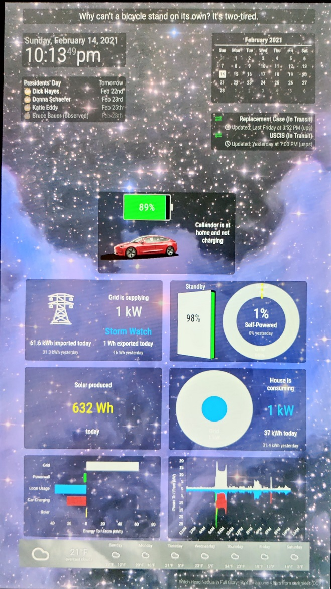
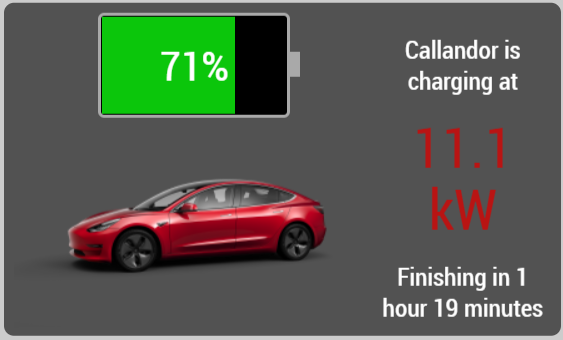
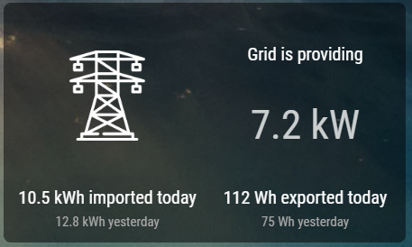
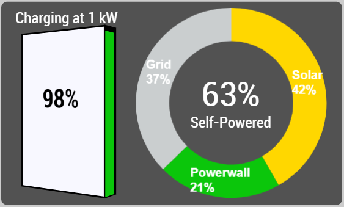
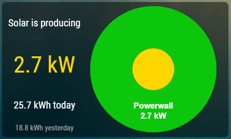
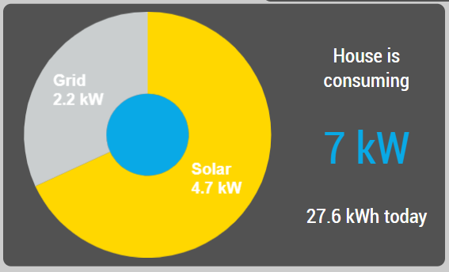
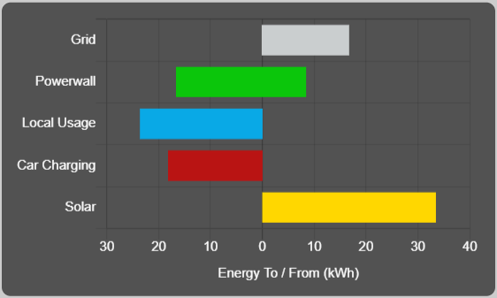
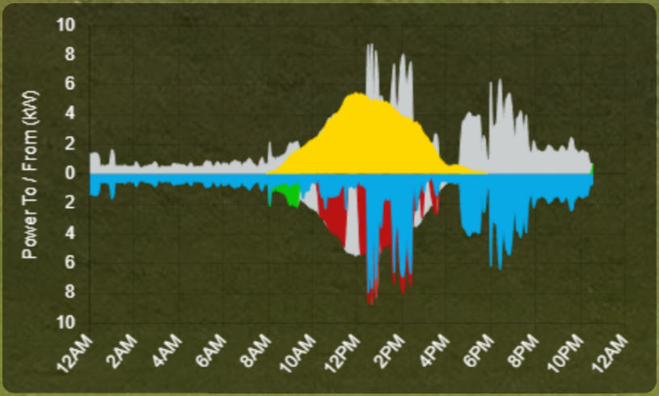

# MMM-Powerwall

This is a module for the
[MagicMirror²](https://github.com/MichMich/MagicMirror/).  It displays data from
your [Tesla Powerwall](https://www.tesla.com/powerwall) on your Magic Mirror,
optionally including car charging data pulled from your
[TWCManager](https://github.com/ngardiner/TWCManager/) (v1.2.0 or later).



If using all the graphs, this works best in one of the full-width positions
(`upper_third`, `middle_center`, `lower_third`); individual graphs can work
nicely in other positions.

## Using the module

To use this module, clone this repo into ~/MagicMirror/modules, run `npm
install` to get dependencies, and add the following configuration block to the
modules array in the `config/config.js` file:
```js
var config = {
    modules: [
        {
            module: 'MMM-Powerwall',
            position: 'lower_third',
            config: {
                // See below for configurable options
            }
        }
    ]
}
```
You will need to restart the MagicMirror process to load the node_helper.

Authentication depends on Python, due to issues with Node and Raspberry Pi.
Make sure you have Python and requests installed:  `sudo apt install python3 python3-requests`

**Do not forget to run `npm install` after updating the module; new dependencies
are being introduced because of Tesla's new authentication model.**

## Configuration options

| Option                | Description
|---------------------- |-----------
| `powerwallIP`         | *Required* IP address of the Powerwall endpoint to query
| `powerwallPassword`   | *Optional* Password for local Powerwall endpoint
| `teslaAPIUsername`    | *Recommended* Username for your Tesla account
| `teslaAPIPassword`    | *Optional* Password for your Tesla account; see below for more options
| `siteID`              | *Optional* if your Tesla account has exactly one energy site; required if multiple are present
| `twcManagerIP`        | *Optional* IP address or hostname of TWCManager instance; if omitted, Tesla API data will be used
| `twcManagerPort`      | *Optional* port of TWCManager's web interface; default is `8080`
| `graphs`              | *Optional* Array of tiles to show. Possible values are described below; default is all
| `localUpdateInterval` | *Optional* How often (in milliseconds) to poll local endpoints (Powerwall and TWCManager)<br>Default 10000 milliseconds (10 seconds)
| `cloudUpdateInterval` | *Optional* How often (in milliseconds) to poll Tesla API<br>Default 300000 milliseconds (five minutes)
| `home`                | *Optional* Coordinates (`[lat, lon]`) of your home; used to indicate when car is at home and to get sunrise/sunset times
| `debug`               | *Optional* Enables additional debug output to the browser tools Console and to stderr on the MM, useful for troubleshooting
| `teslamate`           | *Optional* See below

### Graphs

This module implements several different graphs.  Currently, these are:

- CarCharging<br>
- Grid<br>
- PowerwallSelfPowered<br>
- SolarProduction<br>
- HouseConsumption<br>
- EnergyBar<br>
- PowerLine<br>

By default, all are displayed.  However, as needed by your layout, you can
instantiate multiple instances of this module, each displaying different graphs
or even targeting different Powerwall systems.  All data is requested, cached,
and distributed by the node_helper, so multiple instances referencing the same
target will still update simultaneously and will not increase the volume of
requests made to either local or cloud endpoints.

### Authentication

This module relies on being able to access your Powerwall both locally and via
the Tesla API.  On older firmware versions, the local endpoint interactions
required no authentication; this changed in 20.49.0. To authenticate to either
API, you have two options:

- **Sign in via the module. (Recommended)**
  After installing the module, visit `/MMM-Powerwall/auth` on your MagicMirror
  HTTP port, e.g. `http://192.168.0.52:8080/MMM-Powerwall/auth`.  You can sign
  in with your username and password to each account.  The module will cache
  tokens for the Tesla API, but needs to retain the actual password for the
  local API. It is NOT RECOMMENDED that these be the same password.  If signing
  in this way, you only need to include your username and Powerwall IP in the
  module configuration.

- **Include your passwords in the module configuration.**
  Note that the client downloads `config.js` during load, so anything in your
  config file passes unencrypted over the network (unless you've set up TLS).
  This method also does not work with the Tesla API if MFA is enabled.

The module will generate `tokens.json` (for the Tesla API) and `localpw.json`
(for the local Powerwall) after the first successful load with the password(s),
so you can remove the password from your `config.js` file afterward if desired.

Neither the password nor the tokens are sent anywhere except from the
node_helper to the Tesla API.  Feel free to verify this in the code.

### Teslamate Integration

If you have installed [Teslamate](https://github.com/adriankumpf/teslamate), it
exposes an MQTT server with information about monitored Tesla vehicles.  To
make the best use of this integration:

- Your mosquitto instance should have the options `persistence true` and a 
  `persistence_location` configured.
- Either set `allow_anonymous true` or provide a username and password below.

The `teslamate` configuration option is an object with the following fields:

| Option        | Description
|-------------- |-----------
| `url`         | *Required* URL to access the Mosquitto server
| `namespace`   | *Optional* If you have configured a custom namespace (with MQTT_NAMESPACE), supply it here
| `options`     | *Optional* If you need to pass any [options](https://github.com/mqttjs/MQTT.js/#client) to the MQTT client, supply them here.

The Teslamate connection will be associated with the Tesla account supplied
in the same config.

## Dependencies and Acknowledgements

This module relies on the following APIs:

- The Tesla Owner's API, picked apart at https://www.teslaapi.io/
- The Tesla Compositor API, picked apart at https://teslaownersonline.com/threads/teslas-image-compositor.7089/
- The Powerwall local API, picked apart at https://github.com/vloschiavo/powerwall2
- The TWCManager local API, documented at https://github.com/ngardiner/TWCManager/blob/v1.2.0/docs/modules/Control_HTTP.md
- The Sunrise Sunset API, documented at https://sunrise-sunset.org/api
- The ArcGIS Reverse Geocode API, documented at https://developers.arcgis.com/rest/geocode/api-reference/geocoding-reverse-geocode.htm
- Powerline icon made by [Freepik](https://www.flaticon.com/authors/freepik) from https://www.flaticon.com/

In addition to any commiters to the repo, the following have helped figure certain pieces out:

- @ngardiner's work on TWCManager is amazing, and the car charging could not be tracked without it
- @Kemmey provided initial code for interacting with the compositor
- Access to Tesla's v3 authentication endpoint adapted from [enode-engineering/tesla-oauth2](https://github.com/enode-engineering/tesla-oauth2)
